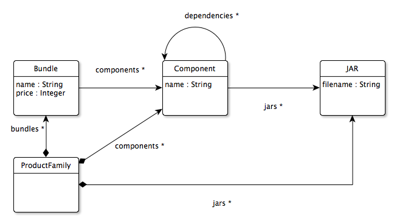

Software vendors often need to build several bundles/packages for their software (e.g. community, professional, enterprise versions). All these bundles are typically assembled from the same pool of components. Different bundles contain different subsets of these components, and components can have dependencies between them (e.g. if component C2 depends on component C1, then bundles that contain C2 must always also contain C1). This use-case is concerned with packaging families of Java applications, consisting of components comprising one or more JARs (bundles typically contain other files too such as images, configuration files etc. but these are ommitted for simplicity).

By modelling a product family using a model that conforms to the metamodel below, a model-to-text transformation can be used to generate ANT/shell scripts that can produce zipped archives containing the JARs of each bundle automatically. The same model can be used to produce product catalogues in a consistent manner.

Beyond model-to-text transformation, this use-case can also be used to demonstrate OCL-like model validation as models conforming to the metamodel need to satisfy constraints that cannot be expressed in Ecore (e.g. each component/JAR needs to appear in at least one bundle, there shouldn't be cyclic dependencies between components).
